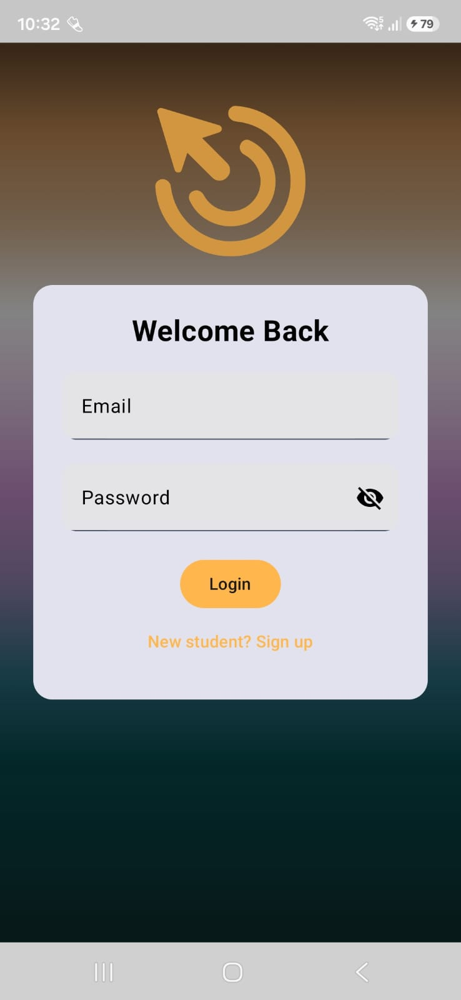
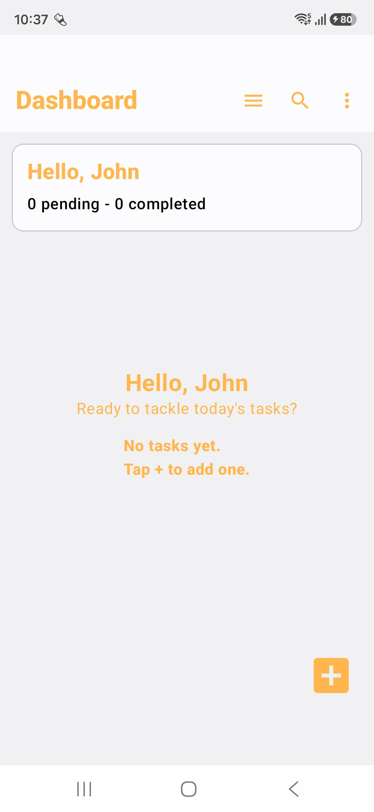
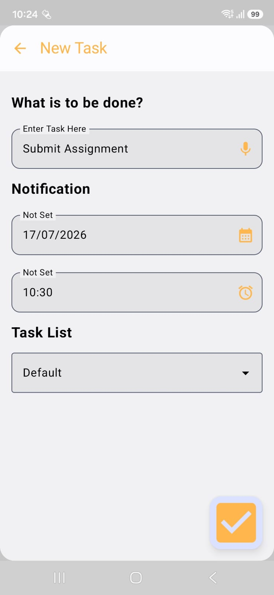
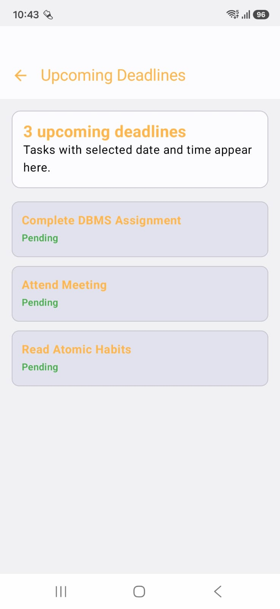
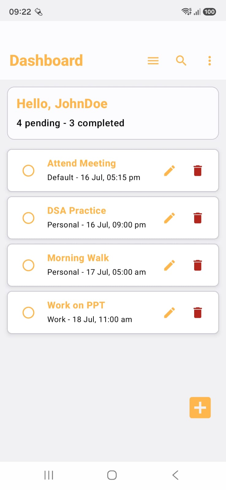
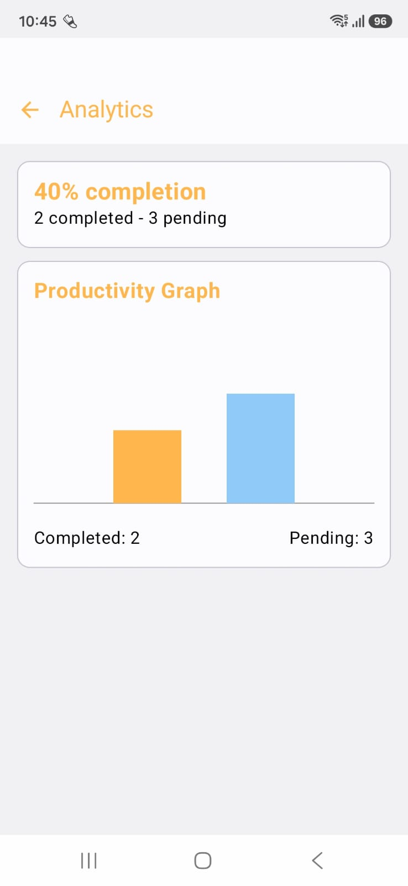
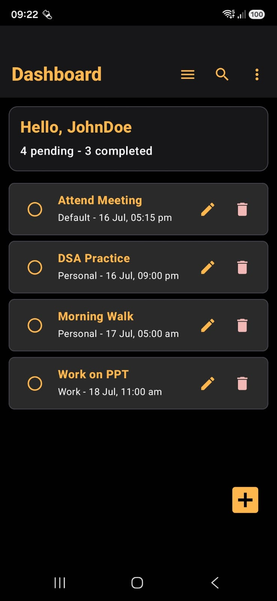
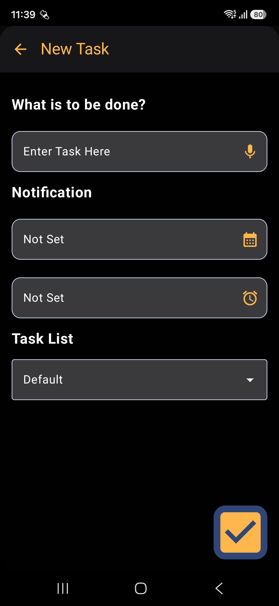
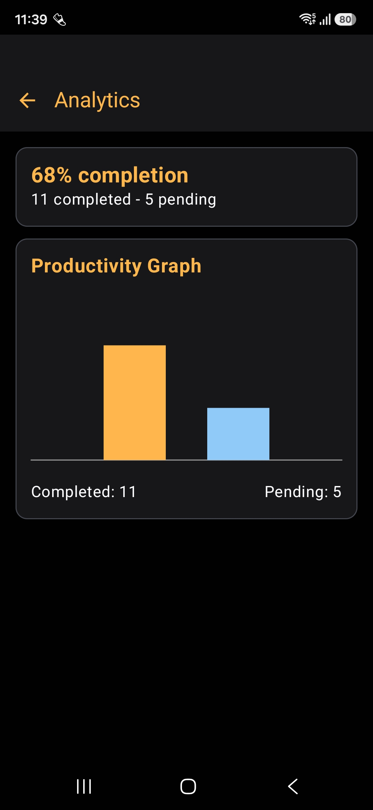

# Student Task Management Application
A modern and user-friendly Student Task Manager application that helps students organize their 
academic and personal activities efficiently. The application aims to improve productivity, 
reduce missed deadlines, and help students manage their daily schedules in a simple and intelligent way.

## Main Objectives
1. Help students manage tasks and assignments easily
2. Improve daily productivity and time management
3. Reduce procrastination and missed deadlines
4. Provide a clean and stress-free user experience
5. Track study habits and progress

# Core Features
1. User Authentication
2. Dashboard

3. Task Management
4. Smart Scheduling
5. Study and Habit Tracking
6. Productivity Analytics
7. Notes Section

# Goal of Student Task Management Application
A smart productivity companion for students by helping them manage tasks, improve focus, maintain consistency, and achieve better academic organization.

# Screenshots
## Welcome Screen and Login/Sign Up Authentication

  
  

## Dashboard and Adding Tasks

   
  

## Deadlines, Completed Tasks and Analytics

  
  
  

## Dark Preview

  
  
  

